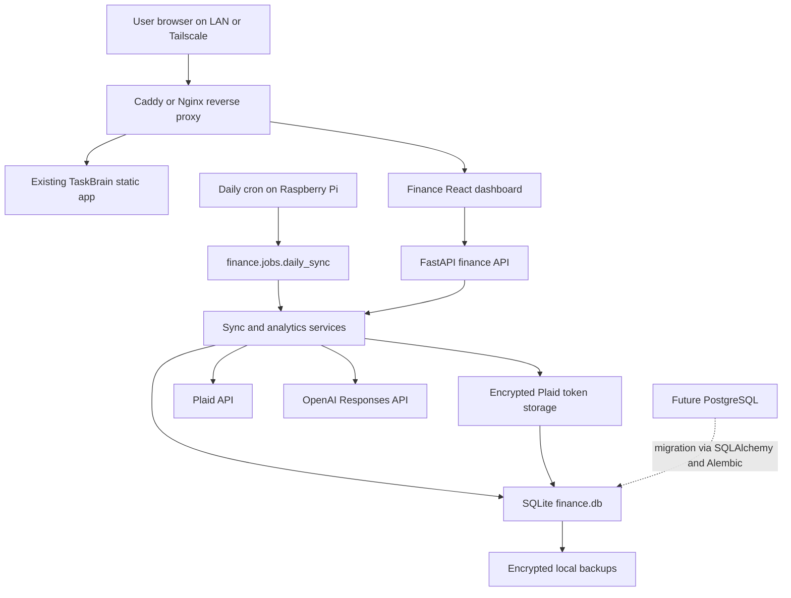

# TaskBrain Financial Intelligence Module

Generated: 2026-06-09

This blueprint adds a self-hosted finance module to the existing TaskBrain app without disrupting the current task dashboard. The current repo is a lightweight Python static server plus browser JavaScript state sync. The finance module should start as a sidecar FastAPI service and React dashboard, then gradually fold into a unified TaskBrain shell once the data model, auth, and sync jobs are stable.

This is product architecture and implementation scaffolding, not financial advice. Debt payoff and forecasting should be calculated by deterministic code first, then explained by AI with clear assumptions.

## 1. System Architecture



Recommended deployment shape on the Raspberry Pi:

- Keep the existing TaskBrain app available as-is.
- Add `finance/backend` as a FastAPI app on `127.0.0.1:8090`.
- Add `finance/frontend` as a Vite React app built to static files and served by Caddy/Nginx under `/finance`.
- Route `/api/finance/*` to FastAPI.
- Use Tailscale for remote access. Do not port-forward this app from the public internet.
- Use cron for the first automation pass; systemd timers are a later improvement.

## 2. Data Source Plan

Plaid integration:

- Use Plaid Link from the frontend to connect institutions.
- Backend creates a Link token with `/link/token/create`.
- Frontend receives a `public_token` from Link.
- Backend exchanges it for an `access_token` with `/item/public_token/exchange`.
- Store Plaid `access_token` encrypted. Never expose it to the browser.
- Use `/accounts/get` for account metadata and cached balances.
- Use `/transactions/sync` for incremental checking, savings, and credit card transactions.
- Use `/transactions/recurring/get` after initial history is complete to identify recurring income and expenses.
- Use `/investments/holdings/get` for holdings and securities.
- Use `/investments/transactions/get` for investment activity.
- Use `/liabilities/get` for supported credit card and loan details.

Important Plaid coverage note:

- Plaid Liabilities is strongest for credit cards, student loans, and mortgages. Auto loans and personal loans may appear as loan accounts with balances, but richer APR/payment/term details may not always be available. The schema below includes manual debt fields so the Debt page still works when Plaid coverage is partial.

OpenAI integration:

- Generate summaries only after deterministic sync and analytics have completed.
- Send aggregate data, deltas, anomaly flags, forecasts, and account display names. Do not send raw tokens, account numbers, user secrets, or unnecessary transaction-level detail.
- Use the Responses API with structured JSON output.
- Keep the model configurable through `OPENAI_MODEL`. As of the official latest-model page checked on 2026-06-09, `gpt-5.5` is the current latest guidance, but the app should not hardcode that forever.

## 3. Database Schema

Design principles:

- Use SQLAlchemy models plus Alembic migrations from day one.
- Use `TEXT` IDs, preferably UUID or ULID strings, so moving to PostgreSQL is straightforward.
- Store money as integer minor units (`amount_cents`) where possible.
- Store investment quantities, prices, APRs, and rates as decimal strings to avoid SQLite floating point surprises.
- Store Plaid raw payloads in `raw_json` text columns for debugging and future migrations.
- Keep analytics snapshots separate from source records.

Core SQLite DDL:

```sql
PRAGMA foreign_keys = ON;

CREATE TABLE users (
  id TEXT PRIMARY KEY,
  email TEXT NOT NULL UNIQUE,
  display_name TEXT NOT NULL,
  password_hash TEXT NOT NULL,
  timezone TEXT NOT NULL DEFAULT 'America/Chicago',
  created_at TEXT NOT NULL,
  updated_at TEXT NOT NULL
);

CREATE TABLE institutions (
  id TEXT PRIMARY KEY,
  plaid_institution_id TEXT UNIQUE,
  name TEXT NOT NULL,
  created_at TEXT NOT NULL
);

CREATE TABLE plaid_items (
  id TEXT PRIMARY KEY,
  user_id TEXT NOT NULL REFERENCES users(id) ON DELETE CASCADE,
  institution_id TEXT REFERENCES institutions(id),
  plaid_item_id TEXT NOT NULL UNIQUE,
  access_token_encrypted TEXT NOT NULL,
  transactions_cursor TEXT,
  products_json TEXT NOT NULL DEFAULT '[]',
  available_products_json TEXT NOT NULL DEFAULT '[]',
  consent_expires_at TEXT,
  status TEXT NOT NULL DEFAULT 'active',
  last_successful_sync_at TEXT,
  last_failed_sync_at TEXT,
  last_error TEXT,
  created_at TEXT NOT NULL,
  updated_at TEXT NOT NULL
);

CREATE TABLE accounts (
  id TEXT PRIMARY KEY,
  user_id TEXT NOT NULL REFERENCES users(id) ON DELETE CASCADE,
  plaid_item_id TEXT REFERENCES plaid_items(id) ON DELETE SET NULL,
  plaid_account_id TEXT UNIQUE,
  name TEXT NOT NULL,
  official_name TEXT,
  mask TEXT,
  type TEXT NOT NULL,
  subtype TEXT,
  classification TEXT NOT NULL, -- asset, debt, contra_asset, manual
  iso_currency_code TEXT NOT NULL DEFAULT 'USD',
  current_balance_cents INTEGER NOT NULL DEFAULT 0,
  available_balance_cents INTEGER,
  credit_limit_cents INTEGER,
  is_active INTEGER NOT NULL DEFAULT 1,
  is_manual INTEGER NOT NULL DEFAULT 0,
  last_balance_at TEXT,
  raw_json TEXT,
  created_at TEXT NOT NULL,
  updated_at TEXT NOT NULL
);

CREATE INDEX idx_accounts_user_classification ON accounts(user_id, classification);

CREATE TABLE account_balance_snapshots (
  id TEXT PRIMARY KEY,
  account_id TEXT NOT NULL REFERENCES accounts(id) ON DELETE CASCADE,
  as_of_date TEXT NOT NULL,
  current_balance_cents INTEGER NOT NULL,
  available_balance_cents INTEGER,
  credit_limit_cents INTEGER,
  source TEXT NOT NULL,
  created_at TEXT NOT NULL,
  UNIQUE(account_id, as_of_date, source)
);

CREATE TABLE budget_categories (
  id TEXT PRIMARY KEY,
  user_id TEXT NOT NULL REFERENCES users(id) ON DELETE CASCADE,
  name TEXT NOT NULL,
  parent_id TEXT REFERENCES budget_categories(id),
  plaid_primary TEXT,
  plaid_detailed TEXT,
  color TEXT,
  is_income INTEGER NOT NULL DEFAULT 0,
  is_archived INTEGER NOT NULL DEFAULT 0,
  created_at TEXT NOT NULL,
  updated_at TEXT NOT NULL,
  UNIQUE(user_id, name)
);

CREATE TABLE transactions (
  id TEXT PRIMARY KEY,
  user_id TEXT NOT NULL REFERENCES users(id) ON DELETE CASCADE,
  account_id TEXT NOT NULL REFERENCES accounts(id) ON DELETE CASCADE,
  plaid_transaction_id TEXT UNIQUE,
  budget_category_id TEXT REFERENCES budget_categories(id) ON DELETE SET NULL,
  posted_date TEXT NOT NULL,
  authorized_date TEXT,
  description TEXT NOT NULL,
  merchant_name TEXT,
  plaid_amount_cents INTEGER NOT NULL,
  cash_flow_cents INTEGER NOT NULL,
  pending INTEGER NOT NULL DEFAULT 0,
  payment_channel TEXT,
  plaid_primary_category TEXT,
  plaid_detailed_category TEXT,
  iso_currency_code TEXT NOT NULL DEFAULT 'USD',
  is_removed INTEGER NOT NULL DEFAULT 0,
  raw_json TEXT,
  created_at TEXT NOT NULL,
  updated_at TEXT NOT NULL
);

CREATE INDEX idx_transactions_user_date ON transactions(user_id, posted_date);
CREATE INDEX idx_transactions_account_date ON transactions(account_id, posted_date);
CREATE INDEX idx_transactions_category_date ON transactions(budget_category_id, posted_date);

CREATE TABLE recurring_streams (
  id TEXT PRIMARY KEY,
  user_id TEXT NOT NULL REFERENCES users(id) ON DELETE CASCADE,
  account_id TEXT REFERENCES accounts(id) ON DELETE SET NULL,
  plaid_stream_id TEXT UNIQUE,
  direction TEXT NOT NULL, -- inflow or outflow
  merchant_name TEXT,
  description TEXT NOT NULL,
  category_id TEXT REFERENCES budget_categories(id) ON DELETE SET NULL,
  frequency TEXT,
  average_amount_cents INTEGER NOT NULL,
  last_amount_cents INTEGER,
  first_date TEXT,
  last_date TEXT,
  next_expected_date TEXT,
  is_active INTEGER NOT NULL DEFAULT 1,
  raw_json TEXT,
  created_at TEXT NOT NULL,
  updated_at TEXT NOT NULL
);

CREATE TABLE monthly_budgets (
  id TEXT PRIMARY KEY,
  user_id TEXT NOT NULL REFERENCES users(id) ON DELETE CASCADE,
  budget_category_id TEXT NOT NULL REFERENCES budget_categories(id) ON DELETE CASCADE,
  month TEXT NOT NULL, -- YYYY-MM
  planned_amount_cents INTEGER NOT NULL,
  alert_threshold_percent INTEGER NOT NULL DEFAULT 90,
  created_at TEXT NOT NULL,
  updated_at TEXT NOT NULL,
  UNIQUE(user_id, budget_category_id, month)
);

CREATE TABLE securities (
  id TEXT PRIMARY KEY,
  user_id TEXT NOT NULL REFERENCES users(id) ON DELETE CASCADE,
  plaid_security_id TEXT,
  ticker_symbol TEXT,
  name TEXT NOT NULL,
  type TEXT,
  close_price_decimal TEXT,
  close_price_as_of TEXT,
  iso_currency_code TEXT DEFAULT 'USD',
  raw_json TEXT,
  created_at TEXT NOT NULL,
  updated_at TEXT NOT NULL,
  UNIQUE(user_id, plaid_security_id)
);

CREATE TABLE holdings (
  id TEXT PRIMARY KEY,
  user_id TEXT NOT NULL REFERENCES users(id) ON DELETE CASCADE,
  account_id TEXT NOT NULL REFERENCES accounts(id) ON DELETE CASCADE,
  security_id TEXT REFERENCES securities(id) ON DELETE SET NULL,
  quantity_decimal TEXT NOT NULL,
  institution_price_decimal TEXT,
  institution_value_cents INTEGER NOT NULL DEFAULT 0,
  cost_basis_cents INTEGER,
  as_of_date TEXT NOT NULL,
  raw_json TEXT,
  created_at TEXT NOT NULL,
  updated_at TEXT NOT NULL,
  UNIQUE(account_id, security_id, as_of_date)
);

CREATE TABLE investment_transactions (
  id TEXT PRIMARY KEY,
  user_id TEXT NOT NULL REFERENCES users(id) ON DELETE CASCADE,
  account_id TEXT NOT NULL REFERENCES accounts(id) ON DELETE CASCADE,
  security_id TEXT REFERENCES securities(id) ON DELETE SET NULL,
  plaid_investment_transaction_id TEXT UNIQUE,
  date TEXT NOT NULL,
  name TEXT NOT NULL,
  type TEXT,
  subtype TEXT,
  quantity_decimal TEXT,
  price_decimal TEXT,
  amount_cents INTEGER NOT NULL,
  fees_cents INTEGER,
  iso_currency_code TEXT DEFAULT 'USD',
  raw_json TEXT,
  created_at TEXT NOT NULL,
  updated_at TEXT NOT NULL
);

CREATE TABLE liability_details (
  id TEXT PRIMARY KEY,
  user_id TEXT NOT NULL REFERENCES users(id) ON DELETE CASCADE,
  account_id TEXT NOT NULL REFERENCES accounts(id) ON DELETE CASCADE,
  liability_type TEXT NOT NULL, -- credit_card, student_loan, mortgage, auto, personal, other
  apr_decimal TEXT,
  minimum_payment_cents INTEGER,
  next_payment_due_date TEXT,
  last_statement_balance_cents INTEGER,
  last_statement_issue_date TEXT,
  original_principal_cents INTEGER,
  origination_date TEXT,
  expected_payoff_date TEXT,
  payment_reference TEXT,
  is_manual_override INTEGER NOT NULL DEFAULT 0,
  raw_json TEXT,
  created_at TEXT NOT NULL,
  updated_at TEXT NOT NULL,
  UNIQUE(account_id)
);

CREATE TABLE debt_payoff_scenarios (
  id TEXT PRIMARY KEY,
  user_id TEXT NOT NULL REFERENCES users(id) ON DELETE CASCADE,
  name TEXT NOT NULL,
  strategy TEXT NOT NULL, -- avalanche, snowball, custom
  extra_payment_cents INTEGER NOT NULL DEFAULT 0,
  result_json TEXT NOT NULL,
  created_at TEXT NOT NULL
);

CREATE TABLE net_worth_snapshots (
  id TEXT PRIMARY KEY,
  user_id TEXT NOT NULL REFERENCES users(id) ON DELETE CASCADE,
  as_of_date TEXT NOT NULL,
  assets_cents INTEGER NOT NULL,
  debts_cents INTEGER NOT NULL,
  net_worth_cents INTEGER NOT NULL,
  cash_cents INTEGER NOT NULL DEFAULT 0,
  investments_cents INTEGER NOT NULL DEFAULT 0,
  retirement_cents INTEGER NOT NULL DEFAULT 0,
  loans_cents INTEGER NOT NULL DEFAULT 0,
  credit_cards_cents INTEGER NOT NULL DEFAULT 0,
  created_at TEXT NOT NULL,
  UNIQUE(user_id, as_of_date)
);

CREATE TABLE sync_runs (
  id TEXT PRIMARY KEY,
  user_id TEXT REFERENCES users(id) ON DELETE SET NULL,
  started_at TEXT NOT NULL,
  finished_at TEXT,
  status TEXT NOT NULL, -- running, success, partial, failed
  trigger TEXT NOT NULL, -- manual, cron, webhook
  accounts_synced INTEGER NOT NULL DEFAULT 0,
  transactions_added INTEGER NOT NULL DEFAULT 0,
  transactions_modified INTEGER NOT NULL DEFAULT 0,
  transactions_removed INTEGER NOT NULL DEFAULT 0,
  error TEXT,
  metadata_json TEXT NOT NULL DEFAULT '{}'
);

CREATE TABLE ai_summaries (
  id TEXT PRIMARY KEY,
  user_id TEXT NOT NULL REFERENCES users(id) ON DELETE CASCADE,
  summary_type TEXT NOT NULL, -- daily, monthly, anomaly, budget, debt, forecast
  period_start TEXT NOT NULL,
  period_end TEXT NOT NULL,
  model TEXT NOT NULL,
  title TEXT NOT NULL,
  summary_markdown TEXT NOT NULL,
  insights_json TEXT NOT NULL,
  input_fingerprint TEXT NOT NULL,
  created_at TEXT NOT NULL
);

CREATE TABLE forecast_snapshots (
  id TEXT PRIMARY KEY,
  user_id TEXT NOT NULL REFERENCES users(id) ON DELETE CASCADE,
  as_of_date TEXT NOT NULL,
  horizon_days INTEGER NOT NULL,
  projected_cash_balance_cents INTEGER NOT NULL,
  assumptions_json TEXT NOT NULL,
  created_at TEXT NOT NULL,
  UNIQUE(user_id, as_of_date, horizon_days)
);

CREATE TABLE audit_events (
  id TEXT PRIMARY KEY,
  user_id TEXT REFERENCES users(id) ON DELETE SET NULL,
  event_type TEXT NOT NULL,
  actor_ip TEXT,
  metadata_json TEXT NOT NULL DEFAULT '{}',
  created_at TEXT NOT NULL
);
```

PostgreSQL migration notes:

- Replace `TEXT` JSON fields with `jsonb`.
- Replace `TEXT` timestamps with `timestamptz` or `date` as appropriate.
- Replace integer boolean columns with `boolean`.
- Keep the app code behind SQLAlchemy repositories so the API does not care which database is underneath.

## 4. Folder Structure

Recommended incremental structure inside this repo:

```text
officedash-ui/
  index.html
  script.js
  style.css
  server.py
  taskbrain.service

  docs/
    financial-intelligence-module.md

  finance/
    backend/
      pyproject.toml
      alembic.ini
      .env.example
      app/
        main.py
        api/
          deps.py
          routes/
            auth.py
            plaid.py
            net_worth.py
            cash_flow.py
            debt.py
            investments.py
            budget.py
            ai.py
            health.py
        core/
          config.py
          security.py
          encryption.py
        db/
          base.py
          session.py
          models.py
          repositories.py
        schemas/
          auth.py
          finance.py
          plaid.py
          ai.py
        services/
          plaid_client.py
          sync_service.py
          analytics_service.py
          debt_service.py
          budget_service.py
          ai_service.py
        jobs/
          daily_sync.py
        tests/
          test_debt_service.py
          test_budget_service.py
          test_sync_mapping.py
      migrations/

    frontend/
      package.json
      vite.config.ts
      src/
        main.tsx
        app/
          FinanceApp.tsx
          routes.tsx
        api/
          client.ts
          finance.ts
        components/
          Money.tsx
          StatTile.tsx
          AllocationChart.tsx
          TrendChart.tsx
        pages/
          NetWorthPage.tsx
          CashFlowPage.tsx
          DebtPage.tsx
          InvestmentsPage.tsx
          BudgetPage.tsx
          SettingsPage.tsx
        styles/
          finance.css

    scripts/
      install-pi.sh
      backup-sqlite.sh
      restore-sqlite.sh

    deploy/
      taskbrain-finance-api.service
      taskbrain-finance-sync.cron
      caddy.example
```

## 5. API Design

All endpoints should live under `/api/finance`.

Authentication and session:

| Method | Path | Purpose |
| --- | --- | --- |
| POST | `/auth/login` | Create secure session cookie |
| POST | `/auth/logout` | Clear session |
| GET | `/auth/session` | Return current authenticated user |
| POST | `/auth/change-password` | Rotate local password |

Plaid setup and sync:

| Method | Path | Purpose |
| --- | --- | --- |
| POST | `/plaid/link-token` | Create Link token for current user |
| POST | `/plaid/exchange-public-token` | Exchange public token, store encrypted access token |
| GET | `/plaid/items` | List connected institutions and sync status |
| DELETE | `/plaid/items/{item_id}` | Disconnect institution and remove token |
| POST | `/sync` | Run manual sync |
| GET | `/sync/runs` | View sync history |

Dashboard:

| Method | Path | Purpose |
| --- | --- | --- |
| GET | `/summary` | Current dashboard summary cards |
| GET | `/net-worth` | Current net worth, trend, allocation |
| GET | `/net-worth/history?months=24` | Historical net worth series |
| GET | `/cash-flow?month=YYYY-MM` | Income, expenses, and category totals |
| GET | `/cash-flow/recurring` | Recurring inflows and outflows |
| GET | `/debt` | Credit card and loan summary |
| POST | `/debt/payoff-scenarios` | Calculate avalanche/snowball/custom payoff projection |
| GET | `/investments` | Balances, holdings, allocation, contribution tracking |
| GET | `/budget?month=YYYY-MM` | Budget vs actual |
| POST | `/budget/categories` | Create category |
| PUT | `/budget/categories/{category_id}` | Update category mapping |
| PUT | `/budget/monthly/{budget_id}` | Update budget target |

AI:

| Method | Path | Purpose |
| --- | --- | --- |
| GET | `/ai/summaries?type=daily` | Historical AI summaries |
| POST | `/ai/summaries/daily` | Generate daily summary from latest data |
| POST | `/ai/summaries/monthly-review` | Generate monthly review |
| POST | `/ai/anomalies` | Generate or refresh anomaly explanations |
| POST | `/ai/forecast` | Generate cash flow forecast explanation |
| POST | `/ai/chat` | Future assistant endpoint, disabled for MVP |

## 6. Dashboard UI Specification

The finance dashboard should be an operational workspace, not a marketing page. Use dense, scan-friendly layouts, restrained panels, and charts that make comparison easy. On mobile, each page should collapse to a single-column summary followed by charts and tables.

Global finance navigation:

- Net Worth
- Cash Flow
- Debt
- Investments
- Budget
- AI Summary
- Settings

Net Worth page:

- Hero metric: current net worth.
- Secondary metrics: total assets, total debts, cash, investments, retirement, credit cards, loans.
- Trend chart: net worth over 3, 6, 12, and 24 months.
- Asset allocation chart: cash, taxable brokerage, retirement, other assets.
- Debt allocation chart: credit card, student loan, mortgage, auto, personal, other.
- Account table: account name, institution, type, current balance, last sync.

Cash Flow page:

- Month selector and rolling 30/90 day toggles.
- Income vs expense chart.
- Monthly cash flow chart.
- Category spending bar chart.
- Recurring expenses table with merchant, frequency, expected date, and amount.
- Top spending changes compared with the prior month.

Debt page:

- Credit card and loan summary cards.
- Debt table with balance, APR, minimum payment, due date, credit limit, utilization, and source.
- Payoff simulator with avalanche, snowball, and custom priority modes.
- Projection chart for debt balance over time.
- Alerts for high utilization, upcoming payments, and missing APR/payment data.

Investment page:

- Brokerage, Roth IRA, 401k, and other investment account balances.
- Holdings table with ticker/name, quantity, price, value, account, and allocation percent.
- Asset allocation by security type and account type.
- Contribution tracking by tax year and account type.
- Investment transaction activity.
- Optional manual classification for holdings Plaid cannot categorize cleanly.

Budget page:

- Month selector.
- Budget vs actual by category.
- Spending alerts based on threshold percent.
- Category trend chart over the last 6 to 12 months.
- Category mapping controls for Plaid categories and merchant rules.
- Unreviewed transactions table for quick cleanup.

AI Summary page:

- Latest daily financial summary.
- Historical summaries grouped by day/month.
- Spending anomalies with supporting metrics.
- Forecast cards such as projected checking balance in 30 days.
- Debt payoff recommendations tied to saved payoff scenarios.
- Clear timestamp showing when the summary was generated and which sync it used.

## 7. Automation Flow

Daily sync order:

1. Create a `sync_runs` row with `status='running'`.
2. For each active Plaid Item, decrypt token in memory only.
3. Sync accounts and balances.
4. Sync transaction changes with cursor state.
5. Sync recurring streams after transaction history is initialized.
6. Sync holdings, securities, investment transactions, and liabilities where enabled.
7. Write account balance snapshots.
8. Compute net worth snapshot.
9. Refresh budget actuals and category trend aggregates.
10. Run anomaly detection and cash forecast calculations.
11. Generate daily AI summary from the aggregate payload.
12. Mark sync run success, partial, or failed.

Anomaly examples:

- Category spend is more than 25 percent above the user's trailing 3-month average.
- An account balance changes by more than a configured threshold.
- Credit card utilization crosses 30, 50, or 80 percent.
- Recurring charge amount changes unexpectedly.
- Checking forecast falls below a configured minimum balance.

Forecasting MVP:

- Start deterministic: current checking balance plus expected recurring inflows minus expected recurring outflows.
- Include pending transactions only when Plaid marks them pending and they are not duplicates of posted transactions.
- Store assumptions in `forecast_snapshots.assumptions_json`.
- Let AI explain the forecast; do not let AI invent the forecast.

## 8. Development Roadmap

Phase 0 - Foundation:

- Add FastAPI project, SQLAlchemy, Alembic, SQLite connection, and health check.
- Add local user auth with Argon2id password hashing and HTTP-only session cookies.
- Add encrypted secret handling and `.env.example`.
- Add Caddy/Nginx local routing plan for `/finance` and `/api/finance`.

Phase 1 - Plaid sandbox integration:

- Implement Link token creation and token exchange.
- Store encrypted access tokens.
- Pull accounts and balances.
- Implement sync run logging.
- Build settings page for connected institutions.

Phase 2 - Transaction and snapshot engine:

- Implement `/transactions/sync` cursor-based updates.
- Map transactions to budget categories.
- Build daily balance and net worth snapshots.
- Add recurring stream ingestion.

Phase 3 - Core dashboard:

- Net Worth page.
- Cash Flow page.
- Budget page with budget vs actual.
- Responsive layout for desktop, tablet, and phone.

Phase 4 - Debt and investment intelligence:

- Pull liabilities and manual debt overrides.
- Build payoff projections.
- Pull holdings and investment transactions.
- Build asset allocation and contribution tracking.

Phase 5 - AI summaries:

- Daily summary after sync.
- Spending anomalies.
- Monthly review.
- Debt payoff recommendations based on deterministic payoff calculations.
- Cash flow forecast explanation.

Phase 6 - Hardening:

- Backups and restore drill.
- Login rate limiting.
- Audit events.
- Tests for sync idempotency, sign normalization, budget math, payoff projections, and AI JSON parsing.
- Raspberry Pi service and cron deployment.

Phase 7 - Future expansion:

- Multi-user authorization boundaries.
- Real estate and manual assets.
- Crypto wallets/exchanges.
- Tax tags and export views.
- Mobile/PWA app.
- AI financial assistant chat with explicit tool permissions.

## 9. MVP Implementation Plan

MVP goal:

Build a daily-refreshing local dashboard that connects Plaid, stores financial history in SQLite, shows net worth/cash flow/budget/debt/investment basics, and generates one daily AI summary.

MVP scope:

- Single local user.
- Plaid Sandbox first, then Development/Production.
- Checking, savings, credit cards, investments, student loans, mortgages where Plaid supports them.
- Manual fields for unsupported APRs and debt payment details.
- One dashboard route group under `/finance`.
- One daily cron job.

MVP steps:

1. Scaffold `finance/backend` and `finance/frontend`.
2. Add auth and session middleware before Plaid work.
3. Add SQLite schema and Alembic migration.
4. Implement encryption helpers and verify encrypted tokens are unreadable in the database.
5. Implement Plaid Link flow in sandbox.
6. Implement account sync and balance snapshots.
7. Implement transaction sync and category mapping.
8. Implement analytics queries for net worth, cash flow, budget actuals, and recurring expenses.
9. Build React pages using TanStack Query and Recharts.
10. Add deterministic debt payoff calculator.
11. Add OpenAI daily summary from aggregate data.
12. Add cron and log output.
13. Add backup script.
14. Test on the Pi through LAN and Tailscale.

Suggested cron:

```cron
30 4 * * * cd /opt/taskbrain-finance/backend && /opt/taskbrain-finance/.venv/bin/python -m app.jobs.daily_sync >> /var/log/taskbrain-finance-sync.log 2>&1
```

On the Pi, use the actual deployment path for your installation.

## 10. Recommended Libraries And Packages

Backend:

- `fastapi` - API framework.
- `uvicorn[standard]` - ASGI server.
- `pydantic-settings` - environment-based settings.
- `sqlalchemy` - database models and repositories.
- `alembic` - migrations for SQLite now and PostgreSQL later.
- `plaid-python` - Plaid SDK.
- `openai` - OpenAI Python SDK.
- `cryptography` - Fernet or AES-GCM token encryption.
- `argon2-cffi` - password hashing.
- `itsdangerous` or `python-jose` - signed sessions or JWTs.
- `httpx` - HTTP client for internal calls and tests.
- `tenacity` - retry transient Plaid/OpenAI failures.
- `orjson` - fast JSON responses if desired.
- `pytest`, `pytest-asyncio`, `respx` - tests.

Frontend:

- `vite`, `react`, `typescript` - lightweight frontend build.
- `react-router-dom` - finance routes.
- `@tanstack/react-query` - server state and caching.
- `recharts` - dashboard charts.
- `react-plaid-link` - Plaid Link integration.
- `zod` - API response validation.
- `date-fns` - date handling.
- `lucide-react` - icons.

Deployment and operations:

- `caddy` or `nginx` - reverse proxy.
- `tailscale` - remote access.
- `ufw` - simple firewall rules.
- `systemd` - API service.
- `cron` - daily sync.
- `sqlite3` - backup and inspection.

## 11. Example Code Skeletons

### Backend settings

```python
# finance/backend/app/core/config.py
from functools import lru_cache
from pydantic_settings import BaseSettings, SettingsConfigDict


class Settings(BaseSettings):
    model_config = SettingsConfigDict(env_file=".env", extra="ignore")

    app_name: str = "TaskBrain Finance"
    database_url: str = "sqlite:///./data/finance.db"
    session_secret: str

    plaid_client_id: str
    plaid_secret: str
    plaid_env: str = "sandbox"
    plaid_products: str = "transactions"
    plaid_optional_products: str = "investments,liabilities"

    token_encryption_key: str

    openai_api_key: str
    openai_model: str = "gpt-5.5"


@lru_cache
def get_settings() -> Settings:
    return Settings()
```

### FastAPI app

```python
# finance/backend/app/main.py
from fastapi import FastAPI
from app.api.routes import ai, auth, budget, cash_flow, debt, health, investments, net_worth, plaid


def create_app() -> FastAPI:
    app = FastAPI(title="TaskBrain Finance API")

    app.include_router(health.router, prefix="/api/finance")
    app.include_router(auth.router, prefix="/api/finance/auth", tags=["auth"])
    app.include_router(plaid.router, prefix="/api/finance/plaid", tags=["plaid"])
    app.include_router(net_worth.router, prefix="/api/finance/net-worth", tags=["net-worth"])
    app.include_router(cash_flow.router, prefix="/api/finance/cash-flow", tags=["cash-flow"])
    app.include_router(debt.router, prefix="/api/finance/debt", tags=["debt"])
    app.include_router(investments.router, prefix="/api/finance/investments", tags=["investments"])
    app.include_router(budget.router, prefix="/api/finance/budget", tags=["budget"])
    app.include_router(ai.router, prefix="/api/finance/ai", tags=["ai"])

    return app


app = create_app()
```

### SQLAlchemy session

```python
# finance/backend/app/db/session.py
from collections.abc import Generator
from sqlalchemy import create_engine
from sqlalchemy.orm import Session, sessionmaker
from app.core.config import get_settings


settings = get_settings()
engine = create_engine(
    settings.database_url,
    connect_args={"check_same_thread": False} if settings.database_url.startswith("sqlite") else {},
)
SessionLocal = sessionmaker(bind=engine, autoflush=False, autocommit=False)


def get_db() -> Generator[Session, None, None]:
    db = SessionLocal()
    try:
        yield db
    finally:
        db.close()
```

### Token encryption

```python
# finance/backend/app/core/encryption.py
from cryptography.fernet import Fernet
from app.core.config import get_settings


def _fernet() -> Fernet:
    return Fernet(get_settings().token_encryption_key.encode("utf-8"))


def encrypt_secret(value: str) -> str:
    return _fernet().encrypt(value.encode("utf-8")).decode("utf-8")


def decrypt_secret(value: str) -> str:
    return _fernet().decrypt(value.encode("utf-8")).decode("utf-8")
```

### Plaid client

```python
# finance/backend/app/services/plaid_client.py
import plaid
from plaid.api import plaid_api
from plaid.model.country_code import CountryCode
from plaid.model.item_public_token_exchange_request import ItemPublicTokenExchangeRequest
from plaid.model.link_token_create_request import LinkTokenCreateRequest
from plaid.model.link_token_create_request_user import LinkTokenCreateRequestUser
from plaid.model.products import Products
from plaid.model.transactions_sync_request import TransactionsSyncRequest
from app.core.config import get_settings


def plaid_client() -> plaid_api.PlaidApi:
    settings = get_settings()
    host = {
        "sandbox": plaid.Environment.Sandbox,
        "development": plaid.Environment.Development,
        "production": plaid.Environment.Production,
    }[settings.plaid_env]

    configuration = plaid.Configuration(
        host=host,
        api_key={
            "clientId": settings.plaid_client_id,
            "secret": settings.plaid_secret,
        },
    )
    return plaid_api.PlaidApi(plaid.ApiClient(configuration))


def create_link_token(user_id: str) -> str:
    settings = get_settings()
    request = LinkTokenCreateRequest(
        client_name="TaskBrain",
        country_codes=[CountryCode("US")],
        language="en",
        user=LinkTokenCreateRequestUser(client_user_id=user_id),
        products=[Products(value.strip()) for value in settings.plaid_products.split(",") if value.strip()],
        optional_products=[
            Products(value.strip())
            for value in settings.plaid_optional_products.split(",")
            if value.strip()
        ],
    )
    response = plaid_client().link_token_create(request)
    return response["link_token"]


def exchange_public_token(public_token: str) -> tuple[str, str]:
    response = plaid_client().item_public_token_exchange(
        ItemPublicTokenExchangeRequest(public_token=public_token)
    )
    return response["access_token"], response["item_id"]


def sync_transactions(access_token: str, cursor: str | None) -> dict:
    request = TransactionsSyncRequest(access_token=access_token, cursor=cursor)
    response = plaid_client().transactions_sync(request)
    return response.to_dict()
```

### Sync service

```python
# finance/backend/app/services/sync_service.py
from datetime import UTC, datetime
from sqlalchemy.orm import Session
from app.core.encryption import decrypt_secret
from app.services import plaid_client


def sync_user_finances(db: Session, user_id: str, trigger: str = "manual") -> None:
    sync_run = start_sync_run(db, user_id=user_id, trigger=trigger)

    try:
        for item in list_active_plaid_items(db, user_id):
            access_token = decrypt_secret(item.access_token_encrypted)

            sync_accounts_and_balances(db, item, access_token)
            sync_transactions_for_item(db, item, access_token)
            sync_recurring_streams_if_ready(db, item, access_token)
            sync_investments_if_enabled(db, item, access_token)
            sync_liabilities_if_enabled(db, item, access_token)

        create_balance_snapshots(db, user_id)
        create_net_worth_snapshot(db, user_id)
        refresh_budget_actuals(db, user_id)
        generate_cash_forecast(db, user_id)
        finish_sync_run(db, sync_run, status="success")
        db.commit()
    except Exception as exc:
        db.rollback()
        mark_sync_failed(db, sync_run, error=str(exc))
        db.commit()
        raise


def utcnow() -> str:
    return datetime.now(UTC).isoformat()
```

The helper names above are intentionally repository-layer functions. Keep Plaid mapping, database writes, and analytics calculations small and separately testable.

### AI daily summary

```python
# finance/backend/app/services/ai_service.py
import hashlib
import json
from openai import OpenAI
from sqlalchemy.orm import Session
from app.core.config import get_settings


DAILY_SUMMARY_SCHEMA = {
    "type": "object",
    "additionalProperties": False,
    "properties": {
        "title": {"type": "string"},
        "summary_markdown": {"type": "string"},
        "insights": {
            "type": "array",
            "items": {
                "type": "object",
                "additionalProperties": False,
                "properties": {
                    "severity": {"type": "string", "enum": ["info", "warning", "urgent"]},
                    "category": {"type": "string"},
                    "message": {"type": "string"},
                    "supporting_metric": {"type": "string"},
                },
                "required": ["severity", "category", "message", "supporting_metric"],
            },
        },
    },
    "required": ["title", "summary_markdown", "insights"],
}


def generate_daily_summary(db: Session, user_id: str, date: str) -> dict:
    settings = get_settings()
    payload = build_daily_finance_payload(db, user_id=user_id, date=date)
    fingerprint = hashlib.sha256(json.dumps(payload, sort_keys=True).encode("utf-8")).hexdigest()

    existing = find_ai_summary_by_fingerprint(db, user_id, "daily", fingerprint)
    if existing:
        return existing

    client = OpenAI(api_key=settings.openai_api_key)
    response = client.responses.create(
        model=settings.openai_model,
        instructions=(
            "You are a personal finance analyst inside a private local dashboard. "
            "Explain only what is supported by the provided metrics. "
            "Do not provide investment, tax, or legal advice. "
            "When recommending debt payoff, reference the deterministic payoff calculation."
        ),
        input=[
            {
                "role": "user",
                "content": json.dumps(payload, separators=(",", ":")),
            }
        ],
        text={
            "format": {
                "type": "json_schema",
                "name": "daily_financial_summary",
                "schema": DAILY_SUMMARY_SCHEMA,
                "strict": True,
            }
        },
    )

    parsed = json.loads(response.output_text)
    return save_ai_summary(
        db,
        user_id=user_id,
        summary_type="daily",
        model=settings.openai_model,
        fingerprint=fingerprint,
        parsed=parsed,
    )
```

### Daily cron job

```python
# finance/backend/app/jobs/daily_sync.py
from app.db.session import SessionLocal
from app.services.ai_service import generate_daily_summary
from app.services.sync_service import sync_user_finances


def main() -> None:
    db = SessionLocal()
    try:
        for user in list_active_users(db):
            sync_user_finances(db, user.id, trigger="cron")
            generate_daily_summary(db, user.id, date=current_user_date(user))
            db.commit()
    finally:
        db.close()


if __name__ == "__main__":
    main()
```

### React API client

```typescript
// finance/frontend/src/api/client.ts
export async function apiGet<T>(path: string): Promise<T> {
  const response = await fetch(`/api/finance${path}`, {
    credentials: "include",
    headers: { Accept: "application/json" },
  });

  if (!response.ok) {
    throw new Error(`API request failed: ${response.status}`);
  }

  return response.json() as Promise<T>;
}

export async function apiPost<T>(path: string, body?: unknown): Promise<T> {
  const response = await fetch(`/api/finance${path}`, {
    method: "POST",
    credentials: "include",
    headers: { "Content-Type": "application/json", Accept: "application/json" },
    body: body ? JSON.stringify(body) : undefined,
  });

  if (!response.ok) {
    throw new Error(`API request failed: ${response.status}`);
  }

  return response.json() as Promise<T>;
}
```

### Net Worth page skeleton

```tsx
// finance/frontend/src/pages/NetWorthPage.tsx
import { useQuery } from "@tanstack/react-query";
import { Area, AreaChart, ResponsiveContainer, Tooltip, XAxis, YAxis } from "recharts";
import { apiGet } from "../api/client";
import { Money } from "../components/Money";

type NetWorthResponse = {
  currentNetWorthCents: number;
  assetsCents: number;
  debtsCents: number;
  trend: Array<{ date: string; netWorthCents: number }>;
  assetAllocation: Array<{ name: string; valueCents: number }>;
  debtAllocation: Array<{ name: string; valueCents: number }>;
};

export function NetWorthPage() {
  const { data, isLoading } = useQuery({
    queryKey: ["net-worth"],
    queryFn: () => apiGet<NetWorthResponse>("/net-worth"),
  });

  if (isLoading || !data) return <main className="finance-page" />;

  return (
    <main className="finance-page">
      <header className="finance-header">
        <div>
          <p className="eyebrow">Financial Intelligence</p>
          <h1>Net Worth</h1>
        </div>
        <strong className="money-hero">
          <Money cents={data.currentNetWorthCents} />
        </strong>
      </header>

      <section className="metric-grid">
        <article className="metric-panel">
          <span>Assets</span>
          <strong><Money cents={data.assetsCents} /></strong>
        </article>
        <article className="metric-panel">
          <span>Debts</span>
          <strong><Money cents={data.debtsCents} /></strong>
        </article>
      </section>

      <section className="chart-panel">
        <ResponsiveContainer width="100%" height={280}>
          <AreaChart data={data.trend}>
            <XAxis dataKey="date" />
            <YAxis tickFormatter={(value) => `$${Math.round(Number(value) / 100)}`} />
            <Tooltip formatter={(value) => [`$${(Number(value) / 100).toLocaleString()}`, "Net worth"]} />
            <Area type="monotone" dataKey="netWorthCents" stroke="#2563eb" fill="#bfdbfe" />
          </AreaChart>
        </ResponsiveContainer>
      </section>
    </main>
  );
}
```

### Plaid Link frontend skeleton

```tsx
// finance/frontend/src/pages/SettingsPage.tsx
import { usePlaidLink } from "react-plaid-link";
import { useMutation, useQuery } from "@tanstack/react-query";
import { apiGet, apiPost } from "../api/client";

export function ConnectPlaidButton() {
  const linkToken = useQuery({
    queryKey: ["plaid-link-token"],
    queryFn: () => apiPost<{ link_token: string }>("/plaid/link-token"),
  });

  const exchange = useMutation({
    mutationFn: (publicToken: string) =>
      apiPost("/plaid/exchange-public-token", { public_token: publicToken }),
  });

  const plaid = usePlaidLink({
    token: linkToken.data?.link_token ?? null,
    onSuccess: (publicToken) => exchange.mutate(publicToken),
  });

  return (
    <button type="button" disabled={!plaid.ready} onClick={() => plaid.open()}>
      Connect account
    </button>
  );
}
```

## 12. Security Checklist

- No public internet exposure or router port forwarding.
- Tailscale remote access only.
- Bind backend to localhost and expose through a reverse proxy.
- Use HTTPS for Tailscale-hosted access if possible.
- Store `PLAID_SECRET`, `OPENAI_API_KEY`, `SESSION_SECRET`, and `TOKEN_ENCRYPTION_KEY` in environment variables.
- Store Plaid access tokens encrypted at rest.
- Hash local passwords with Argon2id.
- Use HTTP-only, SameSite session cookies.
- Add CSRF protection for state-changing browser requests.
- Rate-limit login attempts.
- Log sync metadata, not secrets.
- Redact tokens, API keys, and raw account identifiers from logs.
- Back up SQLite with encrypted archives.
- Test restore before trusting backups.
- Keep Plaid and OpenAI calls server-side only.
- Send only the minimum needed financial aggregates to OpenAI.
- Label AI outputs as analysis based on available data, not professional financial advice.

## 13. Source Links Checked

- Plaid Link API: https://plaid.com/docs/api/link/
- Plaid Accounts API: https://plaid.com/docs/api/accounts/
- Plaid Transactions API: https://plaid.com/docs/api/products/transactions/
- Plaid Investments API: https://plaid.com/docs/api/products/investments/
- Plaid Liabilities API: https://plaid.com/docs/api/products/liabilities/
- OpenAI Responses API: https://platform.openai.com/docs/api-reference/responses
- OpenAI Structured Outputs: https://developers.openai.com/api/docs/guides/structured-outputs
- OpenAI latest model guidance: https://developers.openai.com/api/docs/guides/latest-model
